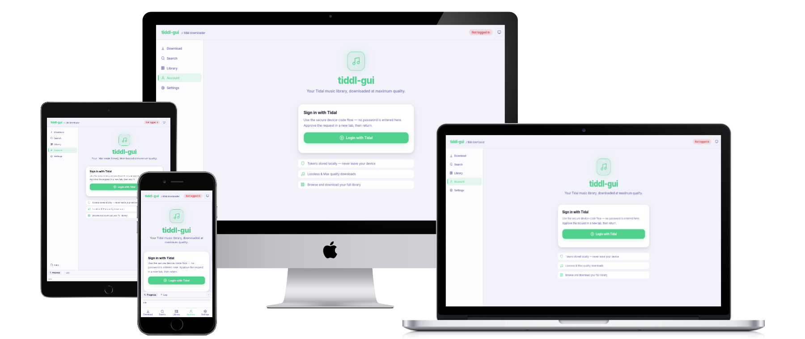

<div align="center">

# tiddl-gui

**Download Tidal tracks, albums, and playlists at maximum quality — straight from your browser.**

[](https://19jvjeffery.github.io/tiddl-gui/web/index.html)
[](LICENSE)
[](https://github.com/19JVJeffery/tiddl-gui/stargazers)

No installation needed — open the link and go.


</td>
 
</div>

> [!WARNING]
> This app is for personal use only and is not affiliated with Tidal. Users must ensure their use complies with Tidal's terms of service and local copyright laws. Downloaded tracks are for personal use and may not be shared or redistributed. The developer assumes no responsibility for misuse of this app.

## How to use

### 1 — Log in

Open the **Account** tab and click **Login with Tidal**.

A Tidal authorisation page opens in a new tab. Approve it there, then return — the app polls automatically and logs you in. Your token is stored in `localStorage` and refreshed automatically; nothing is ever sent to a third-party server.

### 2 — Download

Open the **Download** tab and paste any of the following:

| Input format | Example |
|---|---|
| Full Tidal URL | `https://tidal.com/browse/track/103805726` |
| Track | `track/103805726` |
| Album | `album/103805723` |
| Playlist UUID | `playlist/xxxxxxxx-xxxx-xxxx-xxxx-xxxxxxxxxxxx` |
| Mix ID | `mix/0123456789abcdef` |

Select a quality level and click **Download**. Files are saved directly to your browser's downloads folder.

| Quality | Format | Details |
|:---:|:---:|:---:|
| Low | .m4a | 96 kbps |
| High | .m4a | 320 kbps |
| Lossless | .flac | 16-bit, 44.1 kHz |
| Max | .flac | Up to 24-bit, 192 kHz |

> [!NOTE]
> Lossless / Max quality requires an eligible Tidal subscription. Encrypted (DRM) streams cannot be saved in the browser.

### 3 — Search

Open the **Search** tab, type an artist, track, album, or playlist name, and press **Search**. Click a track to add it to the download queue, or click an artist, album, or playlist card to browse its contents and download items individually or all at once.

### 4 — Library

Open the **Library** tab (requires sign-in) to browse your saved tracks, albums, and playlists.

### 5 — CORS proxy

Tidal's API blocks direct browser requests. All API calls are routed through a CORS proxy; the default is [corsproxy.io](https://corsproxy.io) and needs no setup.

To use a different proxy, open **Settings** and update the **Proxy prefix URL** field.

## Run locally

### Prerequisites

- **Git** — to clone the repository ([git-scm.com](https://git-scm.com))
- A **static file server** — one of the options below (no build step required)

### Start the server

Clone the repo and serve the `web/` directory with any static file server:

**Python 3** (no extra install needed on most systems):
```bash
git clone https://github.com/19JVJeffery/tiddl-gui.git
cd tiddl-gui
python3 -m http.server 8080 --directory web
```

**Node.js** (`npx serve` — downloads and runs automatically):
```bash
git clone https://github.com/19JVJeffery/tiddl-gui.git
cd tiddl-gui
npx serve web -l 8080
```

**VS Code** — install the [Live Server](https://marketplace.visualstudio.com/items?itemName=ritwickdey.LiveServer) extension, open the `web/` folder, and click **Go Live**.

Open <http://localhost:8080> in your browser.

### Stop the server

Press <kbd>Ctrl</kbd>+<kbd>C</kbd> in the terminal where the server is running.

### Uninstall / remove

1. Stop the server (see above).
2. Delete the cloned folder:
   ```bash
   # from the parent directory of tiddl-gui/
   rm -rf tiddl-gui        # macOS / Linux
   rmdir /s /q tiddl-gui   # Windows Command Prompt
   ```
3. If you used `npx serve`, no global package was installed — nothing else to remove.
4. Clear the app's stored data (login tokens, settings) from your browser — choose one:
   - In the app: open **Settings → Advanced / Developer → Clear all data** (removes all tokens and settings).
   - Or via browser DevTools: **Application** → **Local Storage** → select `localhost` → **Clear All**.

## Credits

tiddl-gui is a browser-based GUI built on top of the original [**tiddl**](https://github.com/oskvr37/tiddl) command-line tool by [oskvr37](https://github.com/oskvr37). The API integration and download logic are inspired by that project.
